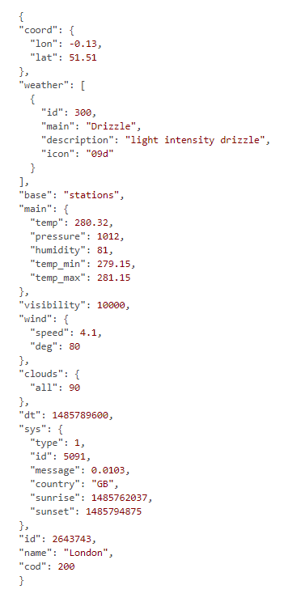

# Python Weather App
## Data
### External Websites
|Weather-Data                 |Country-Flag                 |
| --------------------------- | --------------------------- |
|https://openweathermap.org/  |https://www.countryflags.io  |

### API
The used Data was requested via custom API-Key from [openweathermap](https://openweathermap.org/),  
from there the Data from the [API-Response](https://github.com/Luc-Wshr/DHBW-Python-WeatherApp/blob/main/Organisation/API-Responses) was loaded and parsed via json from where we could extract the required Data to work with    

Example of an API-Call 
   

## Interface
The User-Inferface was designed as a Wireframe on [draw.io](https://app.diagrams.net/) and implemented with Tkinter
   
## Dependencies
### Used Libraries
------------------------------
- Tkinter
  - messagebox
------------------------------
- Datetime, time
  - date
  - timedelta
------------------------------
- Json, requests
  -  api
------------------------------
- Pillow
  - ImageTk
  - Image
------------------------------
